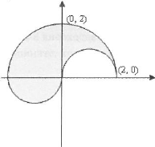

# УП практикум - задачи за 20.10.2023

## Задача 1 

Да се напише прорама, която прочита от стандартния вход дробно число `r` -- радиус на сфера. Намерете и изведете на екрана обема на тази свфера.

## Задача 2

Преминаването от Фаренхайт към Целзий се извършва като извадите 32, умножите по 5 и разделите на 9.

Напишете програма, която по въведени градуси по Фаренхайт да изведе на екрана градусите по Целзий.

## Задача 3

Напишете булев израз, който проверява дали дадено 5-цифрено число е палиндром.

## Задача 4

Да се напише програма, която използва булев израз, за да провери дали подадена от потребителя година е високосна.

## Задача 5

По дадени три цели числа определете дали съществува триъгълник с такива страни.

Вход: 

    3 4 5

Изход: 

    YES

## Задача 6
Да се напише програма, която по дадена точка с кординати x,y от декартова кордитана система извежда дали точката принадлежи на:

- кръг с център (0,0) и радиус 1
- окръжност с център (0,0) и радиус 2

## Задача 7

Напишете логически израз, който е верен тогава и само тогава когато дадена точка принадлежи на оцветента фигура:

## Задача 8

Напишете програма, която приема три реални числа от конзолата и ги извежда на екрана във възходящ ред.

## Задача 9

Да се напише програма, която по зададено число `a` намира корена на уравнението $f(x) = 0$, където

$$
f(x) =
  \begin{cases}
    5xa^{1 \over 3} + |a-1|^{1 \over 2}, \quad a > 0\\
    e^{ax} - a^2 -5, \quad\quad\quad a \le 0.
  \end{cases}
$$

##

Забележка: задачи 8 и 9 са взети от учебника „Програмиране на C++“ на Магдалина Тодорова.

# Идеи

Нещо за булеви изрази;
    Да се покаже и оптимизация при изчисляването - в задачата за палиндром
Тернарен оператор - в задачата за принадлежане
Битови операции
